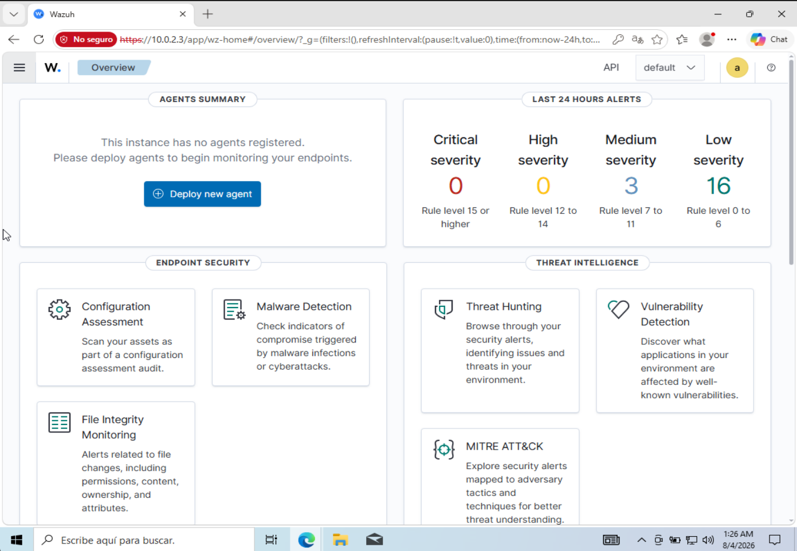
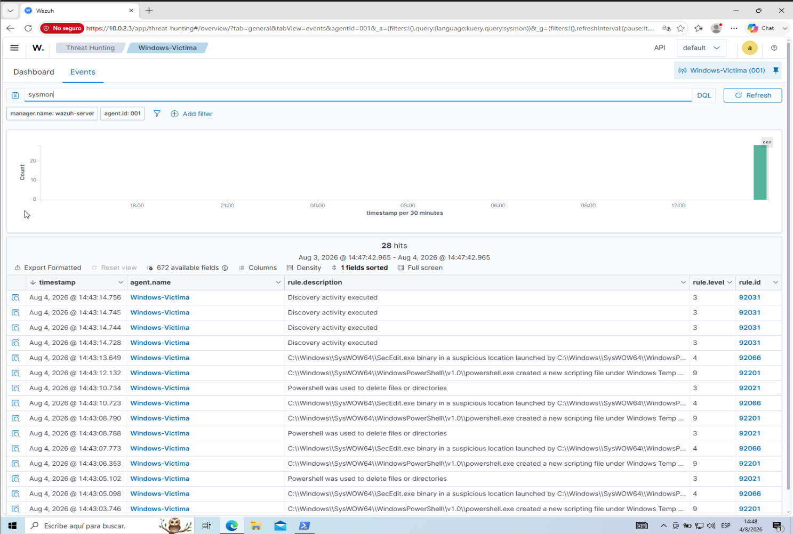
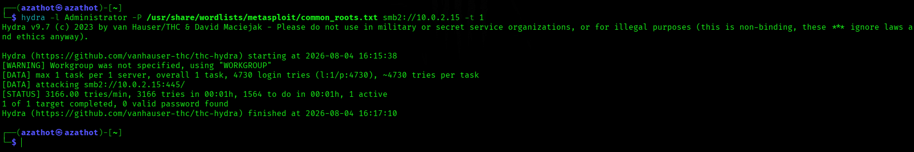
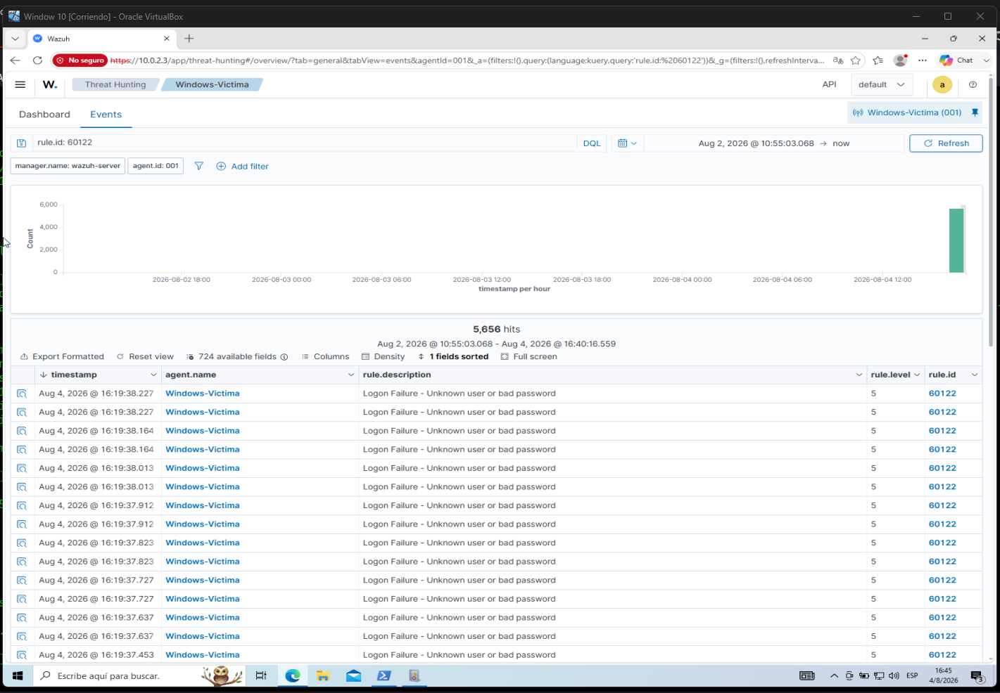
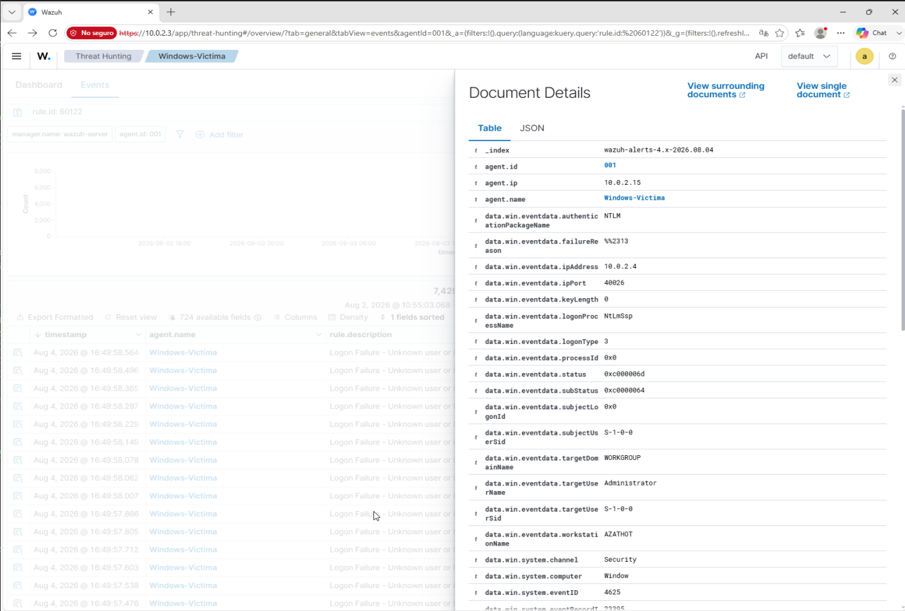
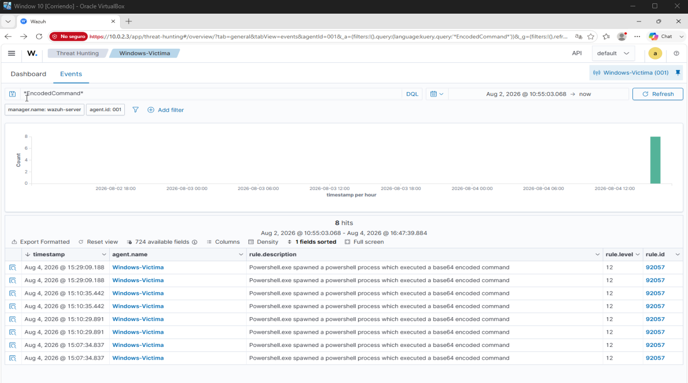

<p align="center">
  
</p>

## 📌 Resumen del Proyecto
Este proyecto documenta la implementación de un entorno de monitoreo y detección de amenazas en tiempo real utilizando **Wazuh SIEM**, **Sysmon** y una máquina víctima **Windows 10**. Se simularon dos vectores de ataque reales desde una máquina atacante **Kali Linux** para validar las capacidades de ingesta, detección, análisis de logs y correlación de eventos en un entorno SOC.

---

## 🏗️ Arquitectura del Laboratorio

| Host / VM | Rol | Sistema Operativo | IP en Lab |
| :--- | :--- | :--- | :--- |
| **Wazuh Server** | SIEM / Manager & Indexer | Linux (Ubuntu/Debian) | `10.0.2.3` |
| **Windows-Victima** | EndPoint (Agente + Sysmon) | Windows 10 Enterprise | `10.0.2.15` |
| **Kali Linux** | Atacante (Red Team) | Kali Linux 2024.x | `10.0.2.4` |

---
## 📂 Estructura del Repositorio y Componentes

El proyecto está organizado en las siguientes carpetas técnicas, representando las etapas de ingeniería de detección, prueba, ingeniería de respuesta e ingesta de logs:

```text
SIEM Log Monitoring and Threat Detection/
├── README.md
├── Screenshots/
│   ├── 01_agent_active.png
│   ├── 02_sysmon_installed.png
│   ├── 03_hydra_attack.png
│   ├── 04_brute_force_detection.png
│   └── 05_powershell_detection.png
├── rules/
│   └── local_rules.xml
├── config/
│   ├── sysmonconfig.xml
│   └── ossec.conf
├── scripts/
│   ├── smb_bruteforce.sh
│   └── encoded_powershell.ps1
└── logs/
    ├── sample_bruteforce_event.json
    └── sample_powershell_event.json
```

### Descripción de Carpetas

* **`rules/` (Reglas de Detección Personalizadas):**
  * `local_rules.xml`: Contiene las reglas escritas en formato XML e implementadas en el motor de Wazuh (`/var/ossec/ruleset/rules/local_rules.xml`). Mapean los eventos recopilados contra las tácticas y técnicas del framework **MITRE ATT&CK** (T1110 y T1059.001) y elevan la severidad de las alertas.

* **`config/` (Archivos de Configuración del Entorno):**
  * `ossec.conf`: Extracto del archivo de configuración del Agente de Wazuh en Windows que habilita la ingesta del canal de eventos de Sysmon y del visor de eventos de Seguridad de Windows (`EventChannel`).
  * `sysmonconfig.xml`: Plantilla de configuración utilizada para instanciar System Monitor (Sysmon) en el endpoint objetivo para la recolección de telemetría de procesos y llamadas del sistema.

* **`scripts/` (Herramientas y Automatización de Ataques Red Team):**
  * `smb_bruteforce.sh`: Script ejecutable en Bash utilizado desde Kali Linux para simular el ataque de denegación/fuerza bruta vía SMB2 con la herramienta Hydra.
  * `encoded_powershell.ps1`: Script de prueba en PowerShell usado para disparar comandos ofuscados en Base64 utilizando el argumento `-EncodedCommand`.

* **`logs/` (Muestras de Telemetría JSON / Eventos SOC):**
  * `sample_bruteforce_event.json`: Estructura real de evento JSON exportada desde Wazuh durante el ataque de fuerza bruta SMB (Event ID 4625 / Rule 60122), evidenciando la IP origen del atacante.
  * `sample_powershell_event.json`: Registro de evento JSON capturado por Sysmon (Event ID 1 / Rule 92057) que detalla la ejecución del binario de PowerShell ejecutando la instrucción codificada.

* **`Screenshots/` (Evidencias Visuales del Laboratorio):**
  * Capturas de pantalla que respaldan la ejecución exitosa de cada fase del laboratorio (agente activo, Sysmon corriendo, simulación de ataque y paneles del dashboard de Wazuh).

---

## 🎯 Vectores de Ataque y Mapeo MITRE ATT&CK

### 1. Ataque de Fuerza Bruta vía SMB
* **Táctica:** Credential Access
* **Técnica MITRE:** [Brute Force (T1110)](https://attack.mitre.org/techniques/T1110/)
* **Herramienta:** `Hydra` (Protocolo SMB2)
* **Log Ingestado:** Windows Security Event ID `4625` / Wazuh Rule ID `60122`

### 2. Ejecución de PowerShell Codificado
* **Táctica:** Execution / Defense Evasion
* **Técnica MITRE:** [PowerShell (T1059.001)](https://attack.mitre.org/techniques/T1059/001/)
* **Herramienta:** `PowerShell.exe` con flag `-EncodedCommand` (Base64)
* **Log Ingestado:** Sysmon Event ID `1` / Wazuh Rule ID `92057`

---

## 📸 Evidencias de Ejecución y Detección

### 1. Estado del Agente Wazuh
Confirmación de conectividad y estado activo del endpoint objetivo.


### 2. Despliegue e Integración de Sysmon
Verificación de la instalación del servicio Sysmon en Windows para telemetría avanzada de procesos.


### 3. Simulación de Ataque desde Kali Linux
Lanzamiento de prueba de fuerza bruta contra el protocolo SMB2 mediante Hydra.


### 4. Detección de Fuerza Bruta (Wazuh Dashboard)
Correlación de múltiples intentos de inicio de sesión fallidos (`Rule ID: 60122`), mostrando la dirección IP de origen de la máquina atacante.



### 5. Detección de Comandos Codificados en PowerShell
Captura de alerta crítica (`Rule ID: 92057`, Severidad Nivel 12) por la ejecución de procesos de PowerShell obfuscados con Base64.


---

## 💡 Recomendaciones SOC / Mitigación

1. **Ataques de Fuerza Bruta (SMB):**
   * Implementar políticas de bloqueo de cuenta (*Account Lockout Threshold*) tras 3 a 5 intentos fallidos.
   * Restringir el tráfico de los puertos `445` (SMB) y `3389` (RDP) mediante reglas de Firewall solo a subredes de administración autorizadas.
   * Habilitar autenticación multifactor (MFA).

2. **Abuso de PowerShell:**
   * Habilitar la directiva de grupo de auditoría extendida: *Script Block Logging* (Event ID `4104`) y *Module Logging*.
   * Configurar PowerShell en modo restringido (*Constrained Language Mode - CLM*) mediante AppLocker o WDAC para evitar la ejecución de payloads codificados.

---
